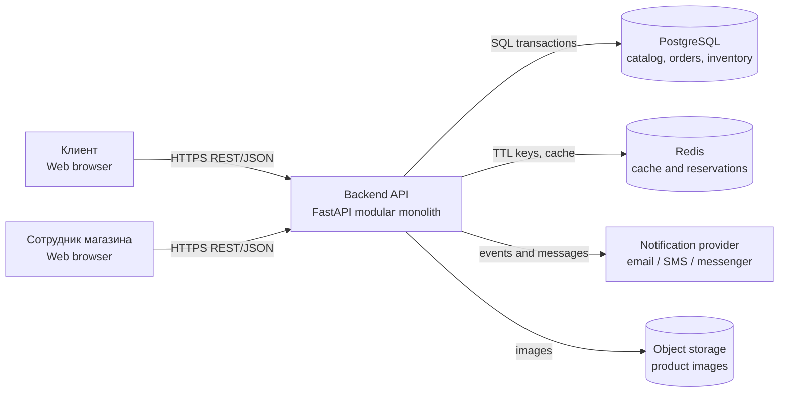

# Архитектура информационной системы цветочного магазина

## 1. Назначение проекта

Система автоматизирует прием и обработку заказов цветочного магазина, учет цветочной продукции и расходных материалов, а также создание индивидуальных букетов через интерактивный конструктор.

Клиент выбирает состав букета и дополнительные элементы. Система проверяет бизнес-правила и остатки, рассчитывает цену, временно резервирует необходимые позиции и создает заказ. Сотрудники магазина управляют каталогом, складом, заменами и статусами заказов.

## 2. Границы MVP

В первую версию входят:

1. каталог цветов, упаковки и дополнительных товаров;
2. конструктор букета;
3. расчет стоимости и проверка наличия;
4. регистрация клиента и оформление заказа;
5. статусы заказа и история изменений;
6. складские остатки, приемка и списание;
7. управление каталогом и заказами сотрудниками;
8. доставка или самовывоз.

За пределами MVP остаются программа лояльности, сложная аналитика, интеграция с несколькими службами доставки и автоматическое распознавание фотографий букетов.

## 3. Пользовательские роли

| Роль | Ответственность |
|---|---|
| Клиент | Собирает букет, оформляет заказ, выбирает способ получения и отслеживает статус. |
| Менеджер | Управляет каталогом, ценами, рецептами, заказами и заменами компонентов. |
| Кладовщик | Принимает поставки, корректирует остатки, резервирует и списывает товар. |
| Флорист | Просматривает состав заказа, собирает букет и фиксирует фактические замены. |
| Администратор | Управляет пользователями, ролями и системными настройками. |

## 4. Основные Use Cases

- UC-01: клиент просматривает каталог;
- UC-02: клиент создает букет в конструкторе;
- UC-03: система пересчитывает состав, наличие и цену;
- UC-04: клиент оформляет заказ;
- UC-05: менеджер подтверждает или отклоняет заказ;
- UC-06: кладовщик проводит приход и списание;
- UC-07: флорист собирает букет;
- UC-08: менеджер изменяет статус заказа;
- UC-09: клиент получает уведомление о статусе;
- UC-10: администратор управляет ролями и доступом.

Подробные сценарии приведены в [docs/use-cases.md](docs/use-cases.md).

## 5. Функциональные требования

| ID | Требование |
|---|---|
| FR-01 | Система хранит каталог компонентов с названием, категорией, единицей измерения, ценой и признаком активности. |
| FR-02 | Система показывает доступный остаток с учетом уже зарезервированных позиций. |
| FR-03 | Конструктор позволяет добавлять и удалять компоненты и изменять их количество. |
| FR-04 | Конструктор проверяет минимальные и максимальные количества, совместимость и доступность. |
| FR-05 | Цена пересчитывается после каждого изменения состава. |
| FR-06 | При оформлении заказа система создает резерв на ограниченный срок. |
| FR-07 | Заказ содержит снимок состава и цены на момент оформления. |
| FR-08 | Система ведет историю статусов и складских операций. |
| FR-09 | Сотрудник может заменить недоступный компонент только на разрешенный аналог. |
| FR-10 | Доступ к операциям определяется ролью пользователя. |

## 6. Нефункциональные требования

- все изменения остатков выполняются транзакционно;
- API использует HTTPS и JWT-сессии;
- пароли хранятся только в виде безопасных хэшей;
- запросы к каталогу и остаткам имеют индексы по внешним ключам и часто используемым полям;
- операции с заказами и складом журналируются;
- API должно возвращать понятные ошибки валидации;
- система должна корректно работать на мобильной ширине экрана;
- резерв заказа автоматически освобождается после истечения срока или отмены.

## 7. Архитектурный стиль

Для MVP выбирается модульный монолит. Один backend разворачивается как приложение, но бизнес-функции разделены на модули: Auth, Catalog, Bouquet, Order, Inventory, Notification и Admin.

Такой вариант уменьшает стоимость разработки и упрощает транзакции между заказом и складом. Выделение отдельных сервисов может быть рассмотрено после появления реальной нагрузки.

## 8. C4 Container

Исходник диаграммы находится в [docs/diagrams/c4-container.mmd](docs/diagrams/c4-container.mmd).

## 9. Основные модули backend

| Модуль | Ответственность |
|---|---|
| Auth | Регистрация, вход, JWT, роли и права. |
| Catalog | Цветы, упаковка, дополнительные товары, категории и цены. |
| Bouquet | Черновик букета, совместимость, расчет цены и состава. |
| Order | Корзина, заказ, статусы, доставка и история изменений. |
| Inventory | Остатки, резервы, приход, списание и перемещения. |
| Notification | Уведомления о создании заказа и изменении статуса. |
| Admin | Пользователи, настройки и аудит действий. |

## 10. Данные

Основные сущности: `User`, `Role`, `CustomerProfile`, `Product`, `Category`, `Warehouse`, `StockBalance`, `StockMovement`, `BouquetRecipe`, `RecipeItem`, `BouquetDraft`, `BouquetDraftItem`, `Order`, `OrderItem`, `OrderStatusHistory`, `Reservation`.

Полная ER-схема находится в [docs/diagrams/erd.dbml](docs/diagrams/erd.dbml), описание модели — в [docs/domain-model.md](docs/domain-model.md).

## 11. Трассировка требований лабораторной работы

| Требование лабораторной работы | Артефакт |
|---|---|
| Минимум две роли и Use Cases | Разделы 3–4 и `docs/use-cases.md` |
| Минимум пять сущностей | Раздел 10 и `docs/diagrams/erd.dbml` |
| C4 Container | Раздел 8 и `docs/diagrams/c4-container.mmd` |
| ERD в 3NF | `docs/diagrams/erd.dbml` |
| README и ARCHITECTURE | `README.md` и этот файл |
